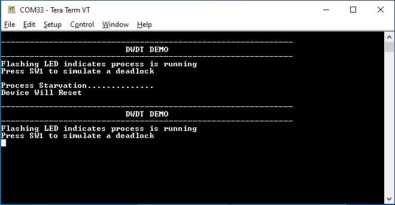

# DWDT timeout

This example application shows how to generate a Dual Watchdog timer reset by simulating a deadlock.

## Description

This example application configures Dual watchdog timer to run in window watchdog mode. Watchdog period is 4 seconds, with 1 second repeat threshold and 3 second level threshold. The switch is used to simulate deadlock and repeat threshold violation. Blinking LED simulates a normal process. When the application is run, the watchdog is cleared after every 2 seconds.

Pressing switch will emulate a deadlock by not clearing the watchdog. LED will remain turned on. 3 seconds after previous watchdog clear, level interrupt will be generated. 4 second after previous watchdog clear, MCU will be reset. 

## Downloading and building the application

To clone or download this application from Github, go to the [main page of this repository](https://github.com/Microchip-MPLAB-Harmony/csp_apps_pic32cx_mt) and then click Clone button to clone this repository or download as zip file.
This content can also be downloaded using content manager by following these [instructions](https://github.com/Microchip-MPLAB-Harmony/contentmanager/wiki).

Path of the application within the repository is **apps/dwdt/dwdt_timeout/firmware** .

To build the application, refer to the following table and open the project using its IDE.

| Project Name      | Description                                    |
| ----------------- | ---------------------------------------------- |
| pic32cx_mtsh_db.X | MPLABX project for [PIC32CXMTSH-Development Board]() |

## Setting up the hardware

The following table shows the target hardware for the application projects.

| Project Name| Board|
|:---------|:---------:|
| pic32cx_mtsh_db.X | [PIC32CXMTSH-Development Board]() |

### Setting up [PIC32CXMTSH-Development Board]()

#### Setting up the board

- Connect a 12V power supply to the board. 
- Connect the Debug USB port (J12) on the board to the computer using a micro USB cable

## Running the Application

1. Open the Terminal application (Ex.:Tera term) on the computer
2. Connect to the EDBG/Jlink Virtual COM port and configure the serial settings as follows:
    - Baud : 115200
    - Data : 8 Bits
    - Parity : None
    - Stop : 1 Bit
    - Flow Control : None
3. Build and run the application using its IDE
4. Console should show the following output and LED should be blinking

    

5. Press Switch to emulate a deadlock
6. Console output is updated as follows and LED is turned on:

        

7. LED starts blinking and a reset print on console indicating a mcu reset

Refer to the following table for Switch names for different boards:

| Board                      | Switch | LED |
| -------------------------- | -------- |--------- |
| [PIC32CXMTSH-Development Board]() | Scroll Down | RED LED (D20) |
