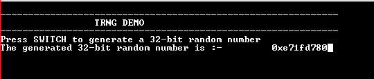

# TRNG random number

This example application shows how to use the TRNG Peripheral library to generate and read a random number.

## Description

This example application shows how to use the TRNG peripheral library to produce a 32-bit true random number. Generated random number can be used as an entropy source for seeding a Deterministic Random Number Generator (DRNG), creating cryptographic keys for ciphers etc.

## Downloading and building the application

To clone or download this application from Github, go to the [main page of this repository](https://github.com/Microchip-MPLAB-Harmony/csp_apps_pic32cx_mt) and then click Clone button to clone this repository or download as zip file.
This content can also be downloaded using content manager by following these [instructions](https://github.com/Microchip-MPLAB-Harmony/contentmanager/wiki).

Path of the application within the repository is **apps/trng/random_number/firmware** .

To build the application, refer to the following table and open the project using its IDE.

| Project Name      | Description                                    |
| ----------------- | ---------------------------------------------- |
| pic32cx_mtsh_db.X | MPLABX project for [PIC32CXMTSH Development Board](https://www.microchip.com/en-us/development-tool/PIC32CXMTSH-DB) |
|||

## Setting up the hardware

The following table shows the target hardware for the application projects.

| Project Name| Board|
|:---------|:---------:|
| pic32cx_mtsh_db.X | [PIC32CXMTSH Development Board](https://www.microchip.com/en-us/development-tool/PIC32CXMTSH-DB) |
|||

### Setting up [PIC32CXMTSH Development Board](https://www.microchip.com/en-us/development-tool/PIC32CXMTSH-DB)

- Power on the board using a 12V power supply on J3
- Attach a debugger to the SWD/JTAG port J17

## Running the Application

1. Build the application using its IDE
2. Open the Terminal application (Ex.:Tera term) on the computer.
3. Connect to the Virtual COM port and configure the serial settings as follows:
    - Baud : 115200
    - Data : 8 Bits
    - Parity : None
    - Stop : 1 Bit
    - Flow Control : None
4. The console displays the following message

    

5. Every time the switch is pressed, a new 32 bit random number is generated and displayed on the console

    

Following table provides the switch name:

| Board      | Switch Name  |
| ---------- | ------------ |
| [PIC32CXMTSH Development Board](https://www.microchip.com/en-us/development-tool/PIC32CXMTSH-DB) | Scroll_Down |
|||
